# 🚀 Kubernetes Hands-on Lab: Apache Web App Deployment

## 📌 Objective

Deploy and manage a simple Apache (`httpd`) web application using Kubernetes.

---

## ⚙️ Prerequisites

* kubectl installed
* Kubernetes cluster running

```bash
kubectl cluster-info
```

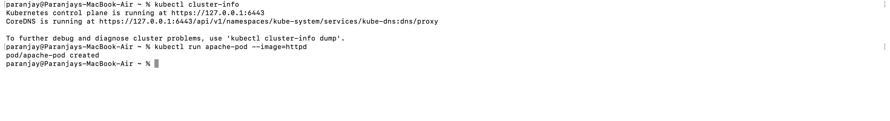

---

## 🧩 Step 1: Run a Pod

```bash
kubectl run apache-pod --image=httpd
```

```bash
kubectl get pods
```

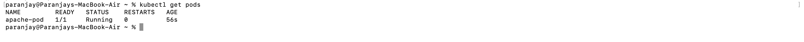

---

## 🧩 Step 2: Inspect Pod

```bash
kubectl describe pod apache-pod
```

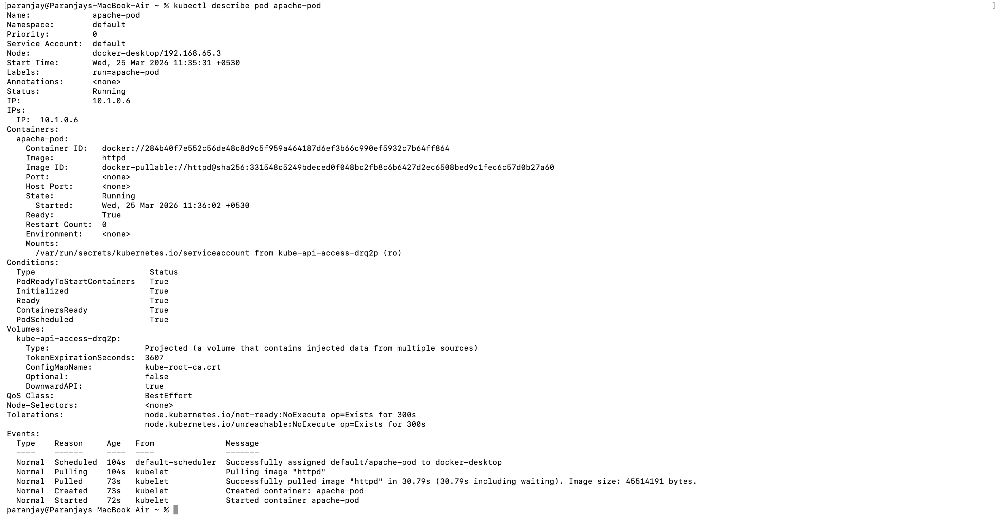

---

## 🌐 Step 3: Access Application

```bash
kubectl port-forward pod/apache-pod 8081:80
```

Open:

```
http://localhost:8081
```

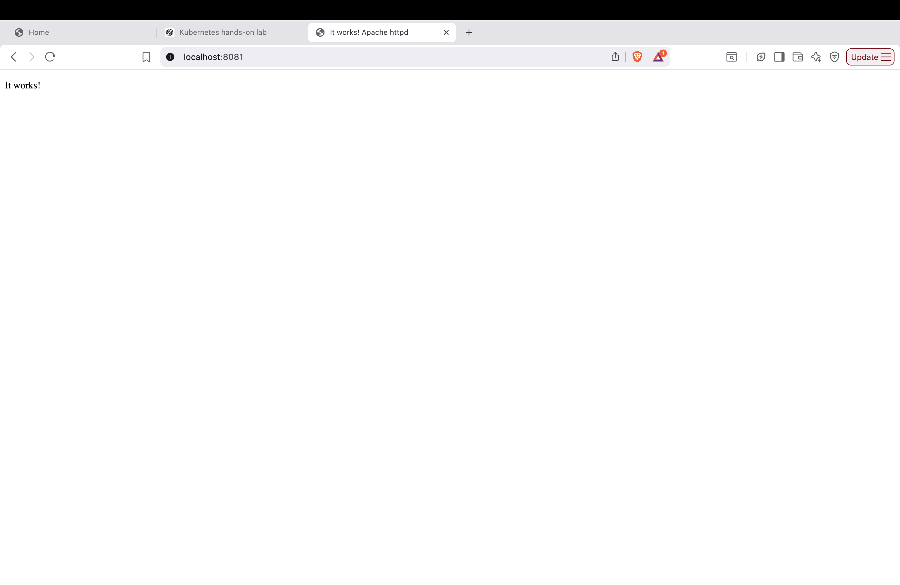

---

## 🗑️ Step 4: Delete Pod

```bash
kubectl delete pod apache-pod
kubectl get pods
```

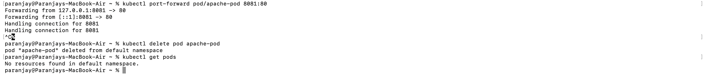

---

## 🧩 Step 5: Create Deployment

```bash
kubectl create deployment apache --image=httpd
kubectl get deployments
kubectl get pods
```

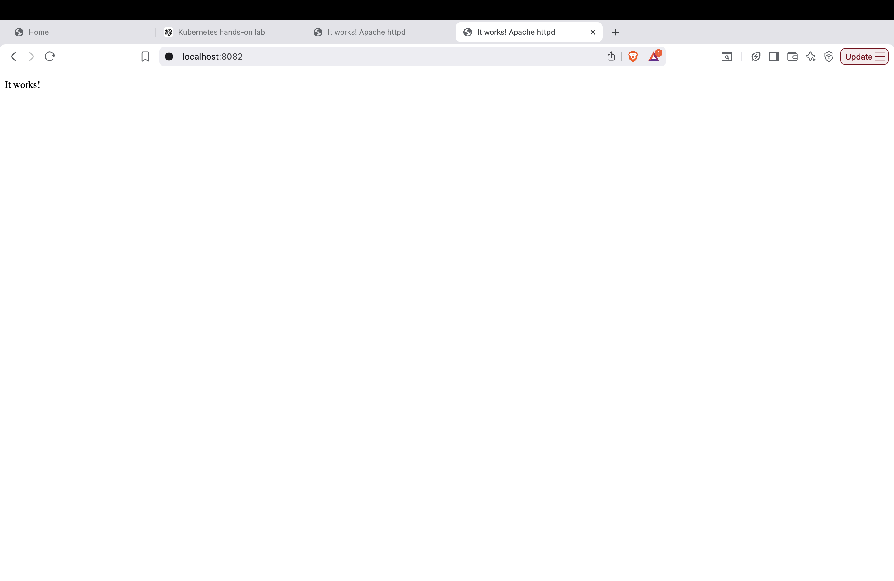

---

## 🌐 Step 6: Expose Deployment

```bash
kubectl expose deployment apache --port=80 --type=NodePort
kubectl port-forward service/apache 8082:80
```

Open:

```
http://localhost:8082
```

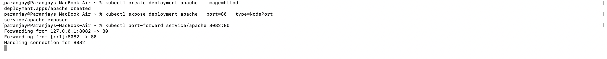

---

## 📈 Step 7: Scale Deployment

```bash
kubectl scale deployment apache --replicas=2
kubectl get pods
```

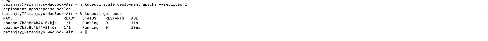

---

## 💥 Step 8: Break the App

```bash
kubectl set image deployment/apache httpd=wrongimage
kubectl get pods
```

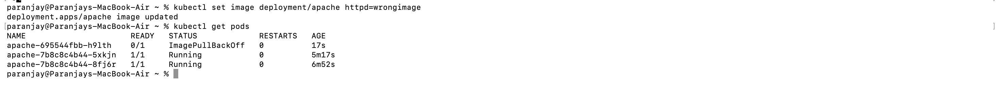

---

## 🔍 Step 9: Diagnose

```bash
kubectl describe pod <pod-name>
```

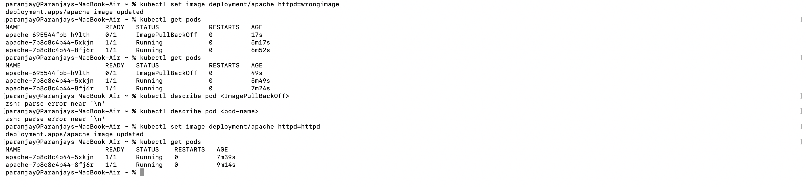

---

## 🛠️ Step 10: Fix the App

```bash
kubectl set image deployment/apache httpd=httpd
kubectl get pods
```

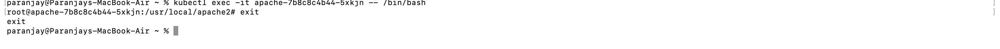

---

## 🖥️ Step 11: Exec into Pod

```bash
kubectl exec -it <pod-name> -- /bin/bash
ls /usr/local/apache2/htdocs
exit
```

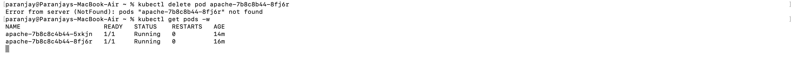

---

## 🔁 Step 12: Self-Healing Test

```bash
kubectl delete pod <pod-name>
kubectl get pods -w
```

👉 New pod is created automatically

---

## 🧹 Cleanup

```bash
kubectl delete deployment apache
kubectl delete service apache
```

---

## 🧠 Key Concepts

| Feature        | Pod | Deployment |
| -------------- | --- | ---------- |
| Auto-healing   | ❌   | ✅          |
| Scaling        | ❌   | ✅          |
| Load Balancing | ❌   | ✅          |

---

## 🎯 Conclusion

This lab demonstrates Kubernetes basics including deployment, scaling, debugging, and self-healing.

---

## 👨‍💻 Author

Paranjay Patil
